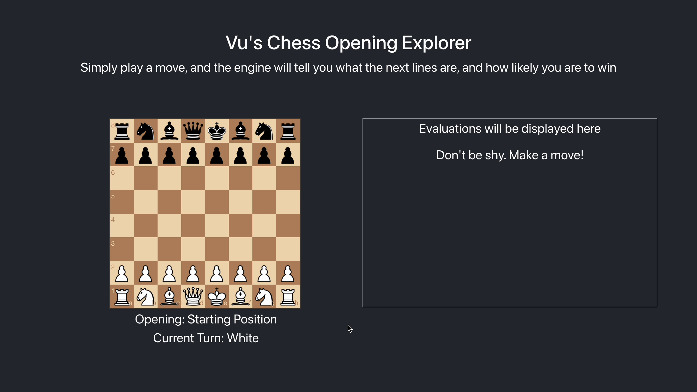

# Chessdata.online  
## 1. ♟️ Overview  
An interactive chess opening explorer powered by the [Lichess API](https://lichess.org/api). Play through openings on a responsive board, track your current position, and view top follow-up lines based on real-world games.

## 2. 🚀 Features  
- **Live Position Tracking** – Automatically detects your current position on the board.
- **Popular Line Suggestions** – Displays common continuations from your position.
- **Interactive Board** – Make moves directly and explore freely.
- **Lichess Integration** – Uses real-world data from millions of games via the Lichess API.  

## 3. 📸 Demo

Want to see how it works? Just head to [chessdata.online](https://chessdata.online) and start exploring!

## 4. 📬 Feedback

Have suggestions or found a bug? Feel free to open an [issue](https://github.com/VuLemon/ChessData/issues). Any feedback is appreciated!

